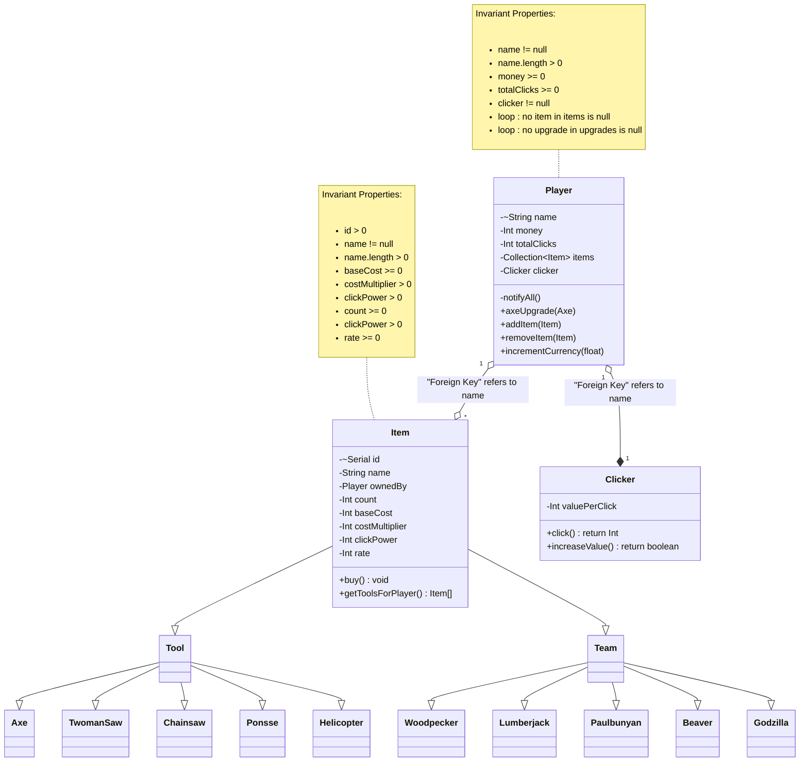

--- 
title: Domain Model for Chopper
author: Spencer Brule (brules@myumanitoba.ca)
date: Winter 2026
---

This file contains Minimum Viable Product domain model design for Chopper Idle, a clicker game where you chop wood.

## Domain Model

