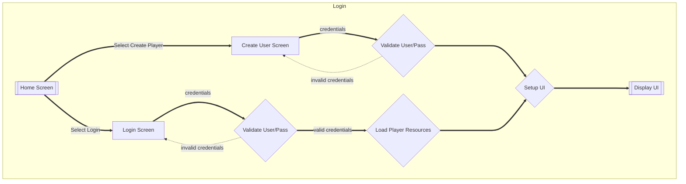
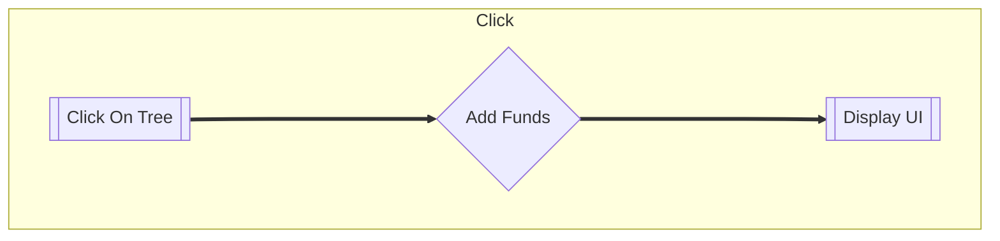
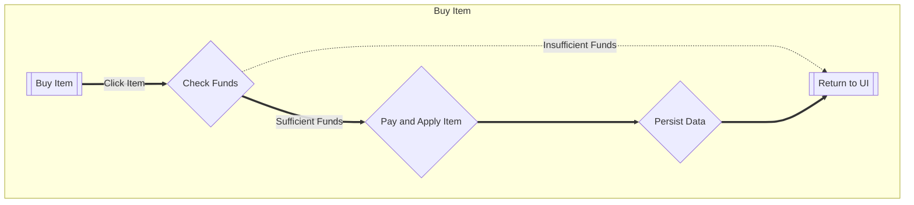
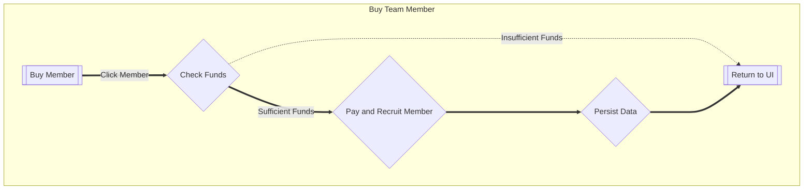

--- 
title: Flows of interaction for Chopper
author: Spencer Brule (brules@myumanitoba.ca)
date: Winter 2026
---

This file contains Minimum Viable Product flow of interaction design for Chopper Idle, a clicker game where you chop wood.

# Flow of Interaction

